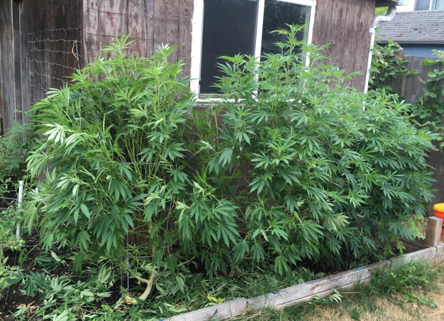
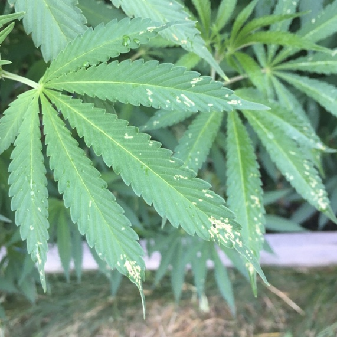
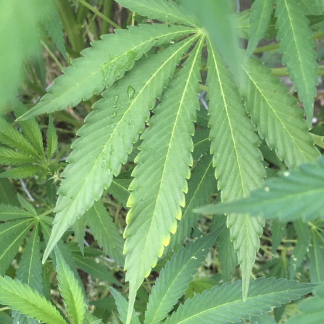

```{r, include=FALSE}
library(emojifont)
library(ggplot2)
```

 

After the heat wave I trimmed Nancy Drew (twisty on the left) and Pegasus (middle). Doc Brown on the far right has sort of been acting as a control so it was trimmed a little, but not to the extent of the other two. It may have been a little late to trim the other two, but I think there will be plenty more heat left in the summer / beginning of fall for them to push out more growth. This summer I was studying for finals before the heat wave, and then taking them during the heat wave. Otherwise trimming them before the heat came in may have been a better move. 

## Nancy Drew

Super twisty and has a few branches that I tried to super crop that are interesting ... Most of her leafs look good. My main concern now is that the branches will be too twiggy to hold the flower off the ground. 

## Pegasus

Tall gal in the middle. My main concerns for this plant are firstly that the back branch broke off and is being held to the plant by some yarn (image not included). Secondly some of the leafs are discolored (images below). 



In the Marijuana Grower's Handbook by Ed Rosenthal it appears that these brown spots might be an early sign of calcium deficiency. 



Using the same book to evaluate these leafs it is a little tricky to diagnose this. The young yellowing leafs in the lower left corner could be a sign of sulfur deficiency, whereas the leaf with the yellow edges could be a sign of magnesium deficiency. Looking at more images online, since there is no orange on these leafs (which otherwise look mostly healthy), I am going to go with the sulfur deficiency. 

Calcium deficiency is easy to remedy with crushed eggshells.

Sulfur I have not dealt with yet, and may be caused from planting my plants too early outside. Ed Rosenthal suggests Epsom salts, so that's what I'm trying.

```{r, echo=FALSE}
ggplot() + geom_emoji("thumbsup", color='darkgreen') + theme_void()

```

Note : All plant names were picked by Tanner.
